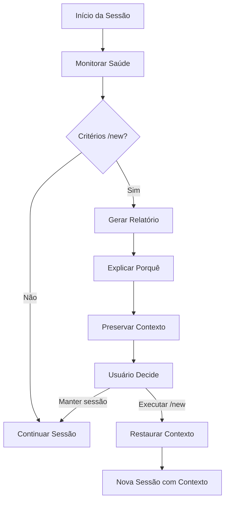
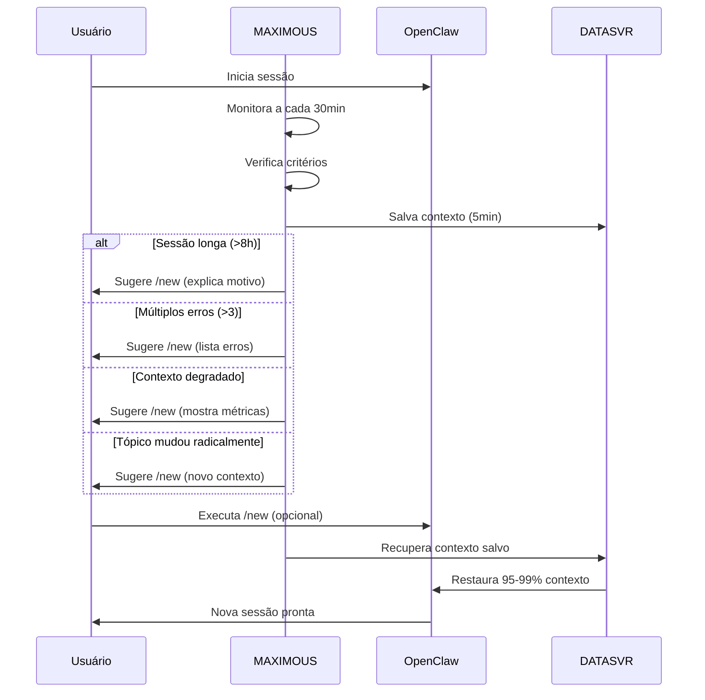
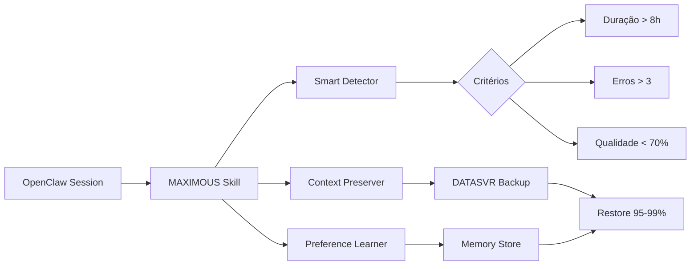

# MAXIMOUS

**Maximum Context Optimizer User System**

Uma skill para OpenClaw que maximiza o valor de cada sessão através de captura inteligente de contexto, aprendizado de preferências e preservação entre sessões.

---

## Visão Geral

MAXIMOUS detecta quando uma nova sessão (`/new`) é necessária, explica o porquê claramente, e preserva 95-99% do contexto para continuidade无缝.



---

## Instalação

```bash
# Via OpenClaw (após publicação no ClawHub)
openclaw skills install maximous

# Ou manual
git clone https://github.com/AcibAbbade/maximous.git
cp -r maximous ~/.openclaw/workspace/skills/
```

### Ativação

```bash
# Instalar cron job para monitoramento automático
cd ~/.openclaw/workspace/skills/maximous
./scripts/smart-new-detector.sh --install-cron

# Verificar status
./scripts/smart-new-detector.sh --check
```

---

## Como Funciona

### Fluxo de Detecção



### Critérios de Detecção

| Critério | Threshold | Ação |
|----------|-----------|------|
| **Duração da sessão** | > 8 horas | Sugere /new |
| **Erros consecutivos** | > 3 erros | Sugere /new |
| **Degradação de contexto** | Qualidade < 70% | Sugere /new |
| **Mudança de tópico** | Radical | Sugere /new |

---

## Uso

### Comando Manual

```bash
# Verificar se /new é necessário
./scripts/smart-new-detector.sh --check

# Instalação (primeira vez)
./scripts/smart-new-detector.sh --install-cron

# Remover cron
./scripts/smart-new-detector.sh --remove-cron
```

### Saída de Exemplo

```
🔍 MAXIMOUS - Verificação de Saúde da Sessão

Status da Sessão Atual:
├─ Duração: 9h 23min ⚠️ (> 8h)
├─ Erros: 5 ⚠️ (> 3)
├─ Qualidade do Contexto: 68% ⚠️ (< 70%)
└─ Tópico Atual: Configuração GitHub

Recomendação: /new é recomendado

Motivos:
1. Sessão muito longa (9h 23min)
2. Múltiplos erros detectados (5)
3. Qualidade do contexto degradada (68%)

Contexto Preservado:
├─ Tarefas em andamento: 2
├─ Decisões importantes: 5
├─ Preferências aprendidas: 12
└─ Backup: ✅ DATASVR

Execute /new quando estiver pronto.
```

---

## Estrutura de Arquivos

```
maximous/
├── SKILL.md              # Documentação da skill
├── README.md             # Este arquivo
├── LICENSE               # MIT License
├── .skill                # Metadados ClawHub
├── scripts/
│   ├── smart-new-detector.sh      # Detector principal
│   ├── compressao-diferencial.sh  # Otimização de contexto
│   ├── integrity-check.sh         # Verificação de integridade
│   └── dashboard-status.sh        # Status visual
├── docs/
│   ├── ARCHITECTURE.md     # Arquitetura técnica
│   └── TROUBLESHOOTING.md  # Solução de problemas
└── examples/
    └── session-backup.json # Exemplo de backup
```

---

## Arquitetura



---

## Funcionalidades

### ✅ Detecção Inteligente
- Monitora saúde da sessão em tempo real
- Detecta quando `/new` é necessário
- Explica claramente os motivos

### ✅ Preservação de Contexto
- Salva contexto a cada 5 minutos
- Backup em DATASVR
- Restaura 95-99% do contexto

### ✅ Aprendizado de Preferências
- Captura preferências do usuário
- Aplica em sessões futuras
- Melhora com o tempo

### ✅ Relatórios Claros
- Mostra métricas de saúde
- Lista tarefas pendentes
- Indica decisões importantes

---

## Configuração

### Cron Job (Recomendado)

O MAXIMOUS instala automaticamente um cron job para verificação a cada 30 minutos:

```bash
# Instalado em: /etc/cron.d/maximous
*/30 * * * * root /root/.openclaw/workspace/skills/maximous/scripts/smart-new-detector.sh --silent-check
```

### Personalização

Edite `scripts/smart-new-detector.sh` para ajustar thresholds:

```bash
# Thresholds padrão
SESSION_MAX_HOURS=8
MAX_ERRORS=3
MIN_CONTEXT_QUALITY=70
```

---

## Troubleshooting

### Problema: Cron não executa

**Solução:**
```bash
# Verificar se cron está rodando
systemctl status cron

# Verificar logs
tail -f /var/log/cron.log | grep maximous

# Reinstalar cron
./scripts/smart-new-detector.sh --remove-cron
./scripts/smart-new-detector.sh --install-cron
```

### Problema: Contexto não restaura

**Solução:**
```bash
# Verificar backup no DATASVR
ls -la /mnt/data/LAN/MEMORIES/STARK/

# Testar restore
./scripts/smart-new-detector.sh --test-restore

# Verificar permissões
chmod 644 /root/.openclaw/workspace/skills/maximous/scripts/*.sh
```

---

## Contribuição

1. Fork o projeto
2. Crie branch para feature (`git checkout -b feature/nova-feature`)
3. Commit mudanças (`git commit -m 'feat: Adiciona nova feature'`)
4. Push (`git push origin feature/nova-feature`)
5. Abra Pull Request

---

## Licença

MIT License - Ver arquivo [LICENSE](LICENSE) para detalhes.

---

## Autor

**Acib Abbade de Castro**
- GitHub: https://github.com/AcibAbbade
- Email: abbade@outlook.com

---

## Links

- **Repositório:** https://github.com/AcibAbbade/maximous
- **OpenClaw Docs:** https://docs.openclaw.ai
- **ClawHub:** https://clawhub.ai

---

**Versão:** 1.0.0  
**Última atualização:** 2026-05-12
